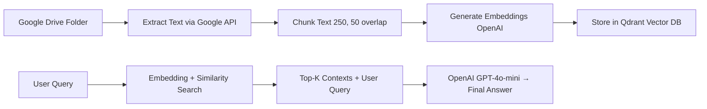

# 🚀 GDrive RAG API

This is an **end-to-end Retrieval-Augmented Generation (RAG)** pipeline that ingests PDF Google Drive documents, chunks them smartly, generates embeddings with **OpenAI text-embedding-3-small**, stores them in **Qdrant**, and answers queries using **OpenAI’s GPT-4o-mini**.

This version is built in **TypeScript**, fully **Dockerized**, and ready to **scale**.

---

##  LIVE DEMO

Check it out at:

🔗 https://gdrive-rag-viknesh.netlify.app/

FrontEnd : Netlify

Backend : Railway

---


##  Stack Overview

| Layer         | Tech                          |
|---------------|-------------------------------|
| Language      | TypeScript                    |
| Embeddings    | OpenAI text-embedding-3-small |
| Vector Store  | Qdrant                        |
| LLM           | OpenAI API (GPT-4o-mini)       |
| File Source   | Google Drive API              |
| Runtime       | Node.js, Express              |
| Deployment    | Docker (Node base)            |
| Hosting       | Railway or any cloud host     |

---

##  API Endpoints

### `POST /ingest`

Ingest and embed PDF documents from a GDrive folder.

**Request Body:**
```json
{
  "folderId": "your-folder-id"
}
````

**Response:**

```json
{
  "message": "Ingestion, chunking, embedding, and upload successful",
  "documents": 4,
  "chunks": 182
}
```

### `POST /clear`

Clears the current Qdrant collection.

### `POST /ask`

used to query about the pdf ingested.

**Request Body:**
```json
{
  "question": "your question here"
}
````

---

##  Environment Variables

Create a `.env` file (or pass at runtime) with the following:

```env
GOOGLE_APPLICATION_CREDENTIALS= ADD THE SERVICE JSON IN A SINGLE LINE, NO LINE BREAKS , NO '' quotes
QDRANT_KEY=your-qdrant-api-key
QDRANT_URL=https://your-qdrant-endpoint
QDRANT_COLLECTION=gdrive-rag-data

OPENAI_API_KEY=your-openai-api-key
```

> The service account JSON file must be mounted when running locally or in Docker.

---

## 🐳 Docker Build & Run Instructions

### 📦 Step 1: Pull Image

```bash
docker pull viknesh1211/gdrive1rag1api
```

### ⚙️ Step 2: Create `.env` File

```env
GOOGLE_APPLICATION_CREDENTIALS=ADD THE SERVICE JSON IN A SINGLE LINE, NO LINE BREAKS , NO '' quotes
QDRANT_KEY=your-qdrant-key
QDRANT_URL=https://your-qdrant-instance
QDRANT_COLLECTION=gdrive-rag-data

OPENAI_API_KEY=your-openai-key
```

### 🚀 Step 4: Run the Container

```bash
docker run -d \
  --name gdrive-rag-api \
  -p 3000:3000 \
  --env-file .env \
  viknesh1211/gdrive1rag1api
```

> Port `3000` is the default. Replace with your own as needed.

## OR

Here are the **Docker commands** to build and run your image locally using the Dockerfile.

---

## 🛠️ Build the Docker Image (Locally)

```bash
docker build -t gdrive1rag1api .
```

This creates a local image named `gdrive1rag1api` from your Dockerfile in the current directory.

---

## 🚀 Run the Docker Container

Make sure you have:

* `.env` file in your current directory (with required variables).
* Service account JSON at `./creds/service-account.json`.

```bash
docker run -d \
  --name gdrive-rag-api \
  -p 3000:3000 \
  --env-file .env \
  gdrive1rag1api
```

---

## 🧠 LLM Pipeline Summary


---

## ✨ Frontend Integration

```js
fetch("http://localhost:3000/ingest", {
  method: "POST",
  headers: { "Content-Type": "application/json" },
  body: JSON.stringify({ folderId: "your-folder-id" })
})
.then(res => res.json())
.then(console.log)
.catch(console.error);
```

---

## 🚨 Troubleshooting

| Error                  | Fix                                                       |
| ---------------------- | --------------------------------------------------------- |
| `CORS`                 | Ensure CORS middleware is set in backend.                 |
| `403 Google`           | Check GDrive file access and service account permissions. |
| `Qdrant Error`         | Validate API key, URL, and collection name.               |
| `Docker ENV Not Found` | Check `.env` file location and format.                    |
| `OpenAI Timeout`         | Use shorter prompts or retry on failure.                  |

---

## 🧼 Clear Qdrant Collection

Use the `/clear` endpoint via Postman or fetch:

```js
fetch("http://localhost:3000/clear", { method: "POST" })
```


---
