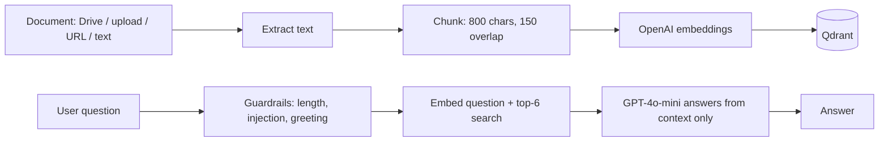

# RAG API

A Retrieval-Augmented Generation (RAG) backend that powers a document-grounded chat assistant. It ingests documents (Google Drive, uploads, URLs, pasted text), chunks them, embeds them with **OpenAI**, stores the vectors in **Qdrant**, and answers questions with **OpenAI GPT-4o-mini**.

The assistant only answers from the ingested documents. Off-topic questions and prompt-injection attempts get a fixed refusal.

---

## Stack

| Layer        | Tech                                   |
|--------------|----------------------------------------|
| Language     | Python 3.11                            |
| API          | FastAPI + Uvicorn                      |
| Embeddings   | OpenAI `text-embedding-3-small` (1536 dims) |
| Vector store | Qdrant                                 |
| LLM          | OpenAI `gpt-4o-mini`                   |
| Sources      | Google Drive, PDF, DOCX, TXT/MD, URL, raw text |
| Deployment   | Docker Compose                         |

---

## How it works



Defaults you may want to tune: chunk size and overlap in `src/chunker.py`, search `limit` (6) in `src/vector_store.py`.

### Guardrails (`src/guardrails.py`)

- Questions over 500 characters are rejected.
- Common prompt-injection phrases ("ignore previous instructions", "reveal your system prompt", "act as", …) get a fixed refusal without calling the LLM.
- Short greetings ("hi", "thanks") get a fixed friendly reply without calling the LLM.
- The system prompt restricts answers to the retrieved context and tells the model to treat context and question as untrusted data.
- Retrieved text is wrapped in `<context>` / `<question>` tags, and any such tags inside documents are stripped.

The fixed replies (`REFUSAL`, `GREETING`, `NO_INFO`) are defined at the top of `src/guardrails.py`.

---

## API

### Chat

| Method | Path   | Description |
|--------|--------|-------------|
| POST   | `/ask` | Ask a question. Body: `{"question": "..."}`. Returns `{question, answer, context}`. |

### Auth

| Method | Path           | Description |
|--------|----------------|-------------|
| POST   | `/auth/login`  | Body: `{"username", "password"}`. Returns a bearer token (8 h) for admin routes. |

### Admin (bearer token required)

| Method | Path                      | Description |
|--------|---------------------------|-------------|
| POST   | `/admin/ingest/drive`     | `{"folder_id", "clear_first"}` — ingest a Drive folder (PDF, DOCX, TXT, MD). |
| POST   | `/admin/ingest/file`      | Multipart upload: `file` (pdf, docx, txt, md), optional `clear_first`. |
| POST   | `/admin/ingest/url`       | `{"url", "clear_first"}` — fetch and ingest a web page. |
| POST   | `/admin/ingest/text`      | `{"text", "title", "clear_first"}` — ingest pasted text. |
| GET    | `/admin/documents`        | List ingested documents with chunk counts. |
| DELETE | `/admin/documents/{id}`   | Delete one document. |
| DELETE | `/admin/collection`       | Clear the whole knowledge base. |
| GET    | `/admin/stats`            | Collection stats. |

### Other

| Method | Path      | Description |
|--------|-----------|-------------|
| GET    | `/health` | Returns 200 with chunk count, or 503 if Qdrant is unreachable. |
| GET    | `/`       | Admin web UI (`index.html`). |

Every response carries an `X-Request-ID` header, which also appears in the logs.

Rate limits (per client IP, per worker): `/ask` 60/min, Drive and URL ingest 5/min, file ingest 10/min.

---

## Configuration

Copy `.env.example` to `.env` and fill it in.

| Variable | Purpose |
|----------|---------|
| `OPENAI_API_KEY` | **Required.** The app refuses to start without it. |
| `OPENAI_MODEL` | Chat model. Default `gpt-4o-mini`. |
| `OPENAI_EMBED_MODEL` | Embedding model. Default `text-embedding-3-small`. |
| `QDRANT_URL` | Qdrant endpoint. Docker Compose overrides it to `http://qdrant:6333`. |
| `QDRANT_KEY` | Qdrant API key, if your instance uses one. |
| `GOOGLE_APPLICATION_CREDENTIALS` | Service-account JSON **on a single line**, no quotes. Needed for Drive ingest. |
| `ADMIN_USERNAME`, `ADMIN_PASSWORD` | Admin login. |
| `JWT_SECRET` | Secret used to sign admin tokens. |
| `CHAT_API_KEY` | Key for the WordPress plugin. |
| `ALLOWED_ORIGINS` | Comma-separated CORS origins. Default `*`. |
| `PORT` | Server port. |
| `LOG_FORMAT` | `text` (default) or `json`. Compose sets `json`. |
| `LOG_LEVEL` | Default `INFO`. |

> Changing the embedding model or `VECTOR_DIM` makes existing vectors incompatible. Clear the collection and re-ingest.

---

## Run with Docker Compose

```bash
cp .env.example .env        # fill in the values
docker compose up -d --build
curl localhost:3000/health
```

What Compose gives you:

- **Qdrant** with a persistent volume (`qdrant_storage`) and a healthcheck.
- **Backend** on port 3000 that starts only after Qdrant is healthy, runs 2 workers (`WEB_CONCURRENCY`), and has its own healthcheck.
- Memory limits (1 GB each), JSON logs with rotation (10 MB × 5), and `restart: unless-stopped`.

Useful commands:

```bash
docker compose logs -f backend
docker compose restart backend        # after editing .env
docker compose down                   # keeps the Qdrant volume
```

### Deploy a prebuilt image (Docker Hub)

```bash
# build and push (amd64 for most VMs)
docker buildx build --platform linux/amd64 -t <user>/rag-api:1.0 --push .

# on the VM, with docker-compose.yml and .env in place
BACKEND_IMAGE=<user>/rag-api:1.0 docker compose pull
BACKEND_IMAGE=<user>/rag-api:1.0 docker compose up -d
```

`.env` is excluded from the image (`.dockerignore`); copy it to the VM yourself.

---

## Run the backend locally (Qdrant in Docker)

```bash
docker compose up -d qdrant
python3.11 -m venv .venv && source .venv/bin/activate
pip install -r requirements.txt
QDRANT_URL=http://localhost:6333 uvicorn src.main:app --port 3000 --reload
```

Note that `main.py` loads `.env` with `override=True`, so the `QDRANT_URL` inside `.env` wins over the shell variable. Edit `.env` to `http://localhost:6333` for local runs.

---

## Tests and CI

```bash
pip install -r requirements.txt -r requirements-dev.txt
pytest -q
```

Tests cover the chunker, guardrails, `/ask` behaviour (with OpenAI and Qdrant mocked) and the OpenAI retry logic.

GitHub Actions (`.github/workflows/ci.yml`) runs the tests and builds the image on every push and PR. Pushing a `v*` tag also pushes `<user>/rag-api:<tag>` to Docker Hub; set the `DOCKERHUB_USERNAME` and `DOCKERHUB_TOKEN` repository secrets first.

---

## Reliability and logging

- OpenAI calls retry on 429, 5xx and timeouts (3 attempts, exponential backoff, honours `Retry-After`). If OpenAI is still failing, `/ask` returns 503 with a friendly message.
- Unhandled errors return a JSON 500 and are logged with a stack trace.
- Each request logs one line (method, path, status, latency) tagged with its request ID.
- Each LLM call logs `prompt_tokens` and `completion_tokens`, so you can track cost.

---

## Troubleshooting

| Symptom | Fix |
|---------|-----|
| Backend exits at startup with `OPENAI_API_KEY is not set` | Add the key to `.env`. |
| `/health` returns 503 | Qdrant is down or `QDRANT_URL` is wrong. |
| Every answer is the fixed refusal message | The question was off-topic or matched the injection filter. Check the logs for `Blocked question`. |
| Answers are cut off or miss details | Raise the search `limit` or chunk size. Re-ingest after changing chunk size. |
| Search returns nothing after switching embedding model | Clear the collection and re-ingest. |
| `403` from Google Drive | Share the folder with the service account's email. |
| Port 3000 already in use | `lsof -nP -iTCP:3000 -sTCP:LISTEN` and stop that process or container. |
| Rate limits behave oddly behind a proxy | Keep `--proxy-headers` (set in the Dockerfile) and forward the real client IP. |
